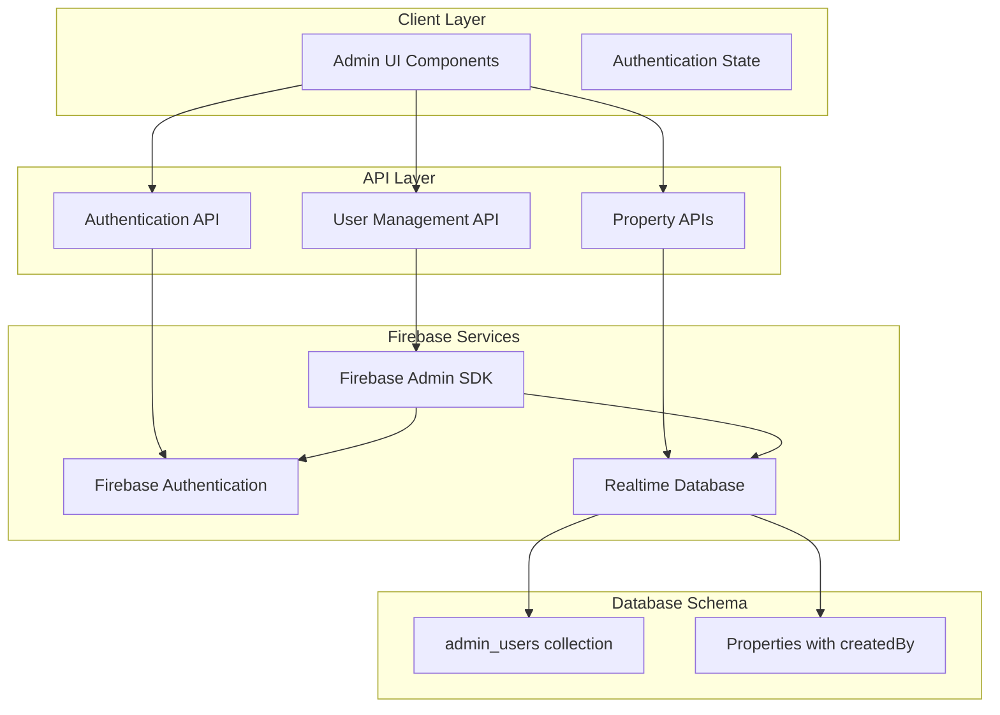

# Design Document: Firebase Admin User Management

## Overview

This design implements a comprehensive Firebase Admin User Management system that enables superusers to create and manage admin accounts with role-based permissions. The system provides granular control over page access and property editing permissions while maintaining clear ownership tracking for all properties.

The solution integrates with the existing Firebase Authentication infrastructure and extends the current admin panel with user management capabilities. It maintains separation between admin users (Firebase) and regular website users (Clerk).

## Architecture

### High-Level Architecture



### Component Architecture

The system consists of three main architectural layers:

1. **Frontend Components**: React components for user management interface
2. **API Layer**: Next.js API routes for user operations and authentication
3. **Database Layer**: Firebase Realtime Database for user data and property ownership

## Components and Interfaces

### Database Schema

#### Admin Users Collection
```typescript
interface AdminUser {
  uid: string;                    // Firebase Auth UID
  email: string;                  // User email address
  name: string;                   // Full name
  role: 'superuser' | 'subuser';  // User role
  permissions: {
    pages: {
      vacant: boolean;            // Access to vacant properties
      plots: boolean;             // Access to plots
      franchise: boolean;         // Access to franchise opportunities
      preleased: boolean;         // Access to pre-leased properties
    };
    viewOthers: boolean;          // Can view properties created by others
    editOthers: boolean;          // Can edit properties created by others
  };
  createdAt: string;              // ISO timestamp
  createdBy: string;              // UID of creator (for audit trail)
}
```

#### Property Ownership Extension
```typescript
interface PropertyWithOwnership {
  // Existing property fields...
  createdBy: string;              // UID of the admin who created this property
  createdAt: string;              // ISO timestamp
  lastModifiedBy?: string;        // UID of last modifier
  lastModifiedAt?: string;        // ISO timestamp of last modification
}
```

### API Interfaces

#### User Creation API
```typescript
// POST /api/admin/users
interface CreateUserRequest {
  name: string;
  email: string;
  password: string;
  role: 'superuser' | 'subuser';
  permissions: {
    pages: {
      vacant: boolean;
      plots: boolean;
      franchise: boolean;
      preleased: boolean;
    };
    viewOthers: boolean;
    editOthers: boolean;
  };
}

interface CreateUserResponse {
  success: boolean;
  user?: {
    uid: string;
    email: string;
    name: string;
    role: string;
  };
  error?: string;
}
```

#### Authentication Verification API
```typescript
// GET /api/auth/verify-permissions
interface PermissionVerificationResponse {
  success: boolean;
  user: {
    uid: string;
    email: string;
    name: string;
    role: 'superuser' | 'subuser';
    permissions: AdminUser['permissions'];
  };
  error?: string;
}
```

### Frontend Components

#### AdminUserForm Component
```typescript
interface AdminUserFormProps {
  onSubmit: (userData: CreateUserRequest) => Promise<void>;
  onCancel: () => void;
  isLoading: boolean;
}

interface AdminUserFormState {
  name: string;
  email: string;
  password: string;
  role: 'superuser' | 'subuser';
  permissions: AdminUser['permissions'];
  errors: Record<string, string>;
}
```

#### UserManagementPage Component
```typescript
interface UserManagementPageState {
  users: AdminUser[];
  isLoading: boolean;
  showCreateForm: boolean;
  error: string | null;
}
```

#### Enhanced AdminLayout Component
```typescript
interface AdminLayoutProps {
  children: ReactNode;
}

interface AdminLayoutState {
  currentUser: AdminUser | null;
  navigationItems: NavigationItem[];
  isLoading: boolean;
}

interface NavigationItem {
  name: string;
  href: string;
  icon: ReactNode;
  visible: boolean;  // Based on user permissions
}
```

## Data Models

### User Permission Model
The permission system uses a hierarchical approach:

1. **Role-based permissions**: Superuser vs Subuser
2. **Page-level permissions**: Granular access to different property types
3. **Data-level permissions**: Control over viewing and editing others' data

### Property Ownership Model
Every property maintains ownership information:

- **createdBy**: Links property to its creator
- **Personal workspace**: Users always see their own properties
- **Cross-user access**: Controlled by viewOthers/editOthers permissions

### Permission Inheritance
```typescript
const getEffectivePermissions = (user: AdminUser): EffectivePermissions => {
  if (user.role === 'superuser') {
    return {
      pages: { vacant: true, plots: true, franchise: true, preleased: true },
      viewOthers: true,
      editOthers: true,
      manageUsers: true
    };
  }
  
  return {
    ...user.permissions,
    manageUsers: false  // Only superusers can manage users
  };
};
```

## Correctness Properties

*A property is a characteristic or behavior that should hold true across all valid executions of a system-essentially, a formal statement about what the system should do. Properties serve as the bridge between human-readable specifications and machine-verifiable correctness guarantees.*

### Property Reflection

After analyzing all acceptance criteria, several properties can be consolidated to eliminate redundancy:

- Properties 2.2, 2.3, 2.4, and 2.5 can be combined into a comprehensive role-based access control property
- Properties 4.1, 4.3, and 4.5 can be combined into a comprehensive property viewing permission property  
- Properties 4.2, 4.4, and 4.5 can be combined into a comprehensive property editing permission property
- Properties 5.2 and 5.3 can be combined into a comprehensive page access control property
- Properties 3.1, 3.3, and 3.4 can be combined into a comprehensive ownership tracking property

### Core Properties

**Property 1: User Creation Authorization**
*For any* user creation request, only users with superuser role should be able to successfully create new admin accounts
**Validates: Requirements 1.4**

**Property 2: Firebase User Creation Integration**  
*For any* valid user creation data submitted by a superuser, the Firebase Admin SDK should create a corresponding Firebase Authentication account
**Validates: Requirements 1.2, 7.1**

**Property 3: User Data Persistence**
*For any* successfully created admin user, their role and permissions should be stored in the Realtime Database under the admin_users collection
**Validates: Requirements 1.3, 5.4**

**Property 4: Role-Based Access Control**
*For any* admin user login, the system should grant access to pages and features based on their role (superuser gets all access, subuser gets filtered access based on permissions)
**Validates: Requirements 2.1, 2.2, 2.3, 2.4, 2.5**

**Property 5: Property Ownership Tracking**
*For any* property creation operation, the system should store the creator's UID in the createdBy field and include this information in all property queries
**Validates: Requirements 3.1, 3.3, 3.4**

**Property 6: Property Viewing Permissions**
*For any* property list request, users should only see properties they have permission to view (own properties + others' properties if viewOthers is enabled, or all properties if superuser)
**Validates: Requirements 4.1, 4.3, 4.5**

**Property 7: Property Editing Permissions**
*For any* property edit request, the system should only allow edits if the user owns the property, has editOthers permission, or is a superuser
**Validates: Requirements 4.2, 4.4, 4.5, 3.5**

**Property 8: Page Access Control**
*For any* page access attempt, the system should hide navigation links and redirect unauthorized access based on the user's page permissions
**Validates: Requirements 5.1, 5.2, 5.3**

**Property 9: User Management Interface Restriction**
*For any* attempt to access the user management interface, only superusers should be granted access
**Validates: Requirements 6.1**

**Property 10: Authentication Token Verification**
*For any* API request, the system should verify the user's token and retrieve current permissions from the database to ensure authorization
**Validates: Requirements 7.2, 7.3**

**Property 11: Permission Revocation Enforcement**
*For any* user whose permissions are modified, subsequent requests should immediately reflect the updated permissions
**Validates: Requirements 7.4**

**Property 12: Authentication System Separation**
*For any* authentication operation, the system should maintain clear separation between admin users (Firebase) and regular users (Clerk)
**Validates: Requirements 7.5**

<function_calls>
<invoke name="prework">
<parameter name="featureName">firebase-admin-user-management

## Error Handling

### Authentication Errors
- **Invalid credentials**: Return 401 with clear error message
- **Expired tokens**: Redirect to login with session expired message
- **Missing permissions**: Return 403 with specific permission requirements

### User Creation Errors
- **Duplicate email**: Return 400 with "Email already exists" message
- **Invalid email format**: Return 400 with validation error
- **Weak password**: Return 400 with password requirements
- **Firebase service errors**: Return 500 with generic error message (log details server-side)

### Permission Errors
- **Unauthorized access**: Redirect to authorized page or show 403 error
- **Invalid role**: Return 400 with valid role options
- **Permission update failures**: Return 500 with retry suggestion

### Database Errors
- **Connection failures**: Implement retry logic with exponential backoff
- **Write failures**: Return 500 with transaction rollback
- **Read failures**: Return cached data if available, otherwise 500

### Error Recovery Strategies
- **Graceful degradation**: Show limited functionality when services are unavailable
- **Retry mechanisms**: Automatic retry for transient failures
- **Fallback authentication**: Maintain session state during temporary Firebase outages
- **User feedback**: Clear error messages with actionable next steps

## Testing Strategy

### Dual Testing Approach
The system will use both unit tests and property-based tests to ensure comprehensive coverage:

- **Unit tests**: Verify specific examples, edge cases, and error conditions
- **Property tests**: Verify universal properties across all inputs using randomized testing
- Both approaches are complementary and necessary for complete validation

### Property-Based Testing Configuration
- **Testing framework**: fast-check for TypeScript/JavaScript property-based testing
- **Test iterations**: Minimum 100 iterations per property test
- **Test tagging**: Each property test tagged with format: **Feature: firebase-admin-user-management, Property {number}: {property_text}**

### Unit Testing Focus Areas
- **Authentication flows**: Login, logout, token verification
- **User creation edge cases**: Invalid inputs, duplicate emails, permission validation
- **Permission enforcement**: Specific role and permission combinations
- **Error handling**: Network failures, invalid data, authorization errors
- **UI components**: Form validation, navigation updates, user feedback

### Property Testing Focus Areas
- **User creation workflows**: Random valid user data should always create accounts successfully
- **Permission enforcement**: Random permission combinations should be consistently enforced
- **Ownership tracking**: Random property operations should maintain correct ownership
- **Role-based access**: Random user roles should receive appropriate access levels
- **Data persistence**: Random user operations should maintain data integrity

### Integration Testing
- **End-to-end user flows**: Complete user creation and management workflows
- **Firebase integration**: Real Firebase operations in test environment
- **Permission cascading**: Changes in permissions should propagate correctly
- **Cross-component communication**: API and UI integration validation

### Testing Environment Setup
- **Test Firebase project**: Separate Firebase project for testing
- **Mock data generation**: Automated generation of test users and properties
- **Test isolation**: Each test should clean up its data
- **Performance testing**: Verify system performance under load