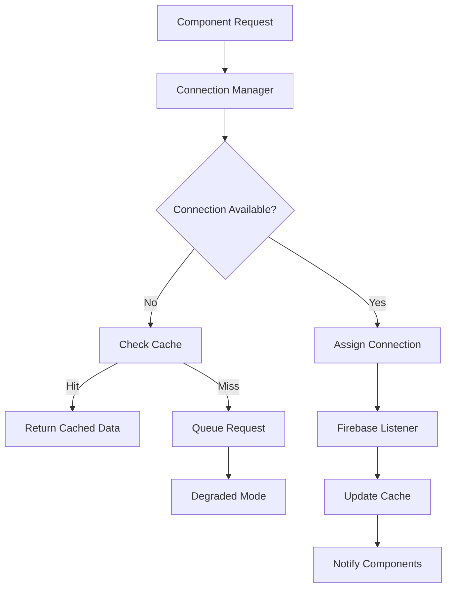

# Design Document

## Overview

The Firebase connection optimization system will implement a comprehensive strategy to reduce unnecessary persistent connections while maintaining essential real-time functionality. The current application uses Firebase Realtime Database extensively with `get()` operations for data fetching, but lacks proper connection management and optimization strategies. This design addresses the 100/100 connection limit by implementing smart connection pooling, listener lifecycle management, and degraded mode fallbacks.

## Architecture

### Core Components

1. **Connection Manager**: Central service for managing Firebase connections and enforcing limits
2. **Listener Registry**: Tracks active listeners and their purposes across the application
3. **Connection Pool**: Shared connection instances for similar data requirements
4. **Cache Layer**: Local caching to reduce need for persistent connections
5. **Degraded Mode Handler**: Fallback mechanisms when connection limits are reached
6. **Monitoring Service**: Real-time tracking of connection usage and patterns

### System Flow



## Components and Interfaces

### 1. Connection Manager

```typescript
interface ConnectionManager {
  // Connection lifecycle
  requestConnection(config: ConnectionConfig): Promise<Connection | null>;
  releaseConnection(connectionId: string): void;
  
  // Connection pooling
  getSharedConnection(key: string): Connection | null;
  createSharedConnection(key: string, config: ConnectionConfig): Connection;
  
  // Monitoring
  getConnectionStats(): ConnectionStats;
  isAtLimit(): boolean;
}

interface ConnectionConfig {
  path: string;
  priority: 'high' | 'medium' | 'low';
  shared: boolean;
  component: string;
  purpose: string;
}
```

### 2. Listener Registry

```typescript
interface ListenerRegistry {
  register(listener: ListenerInfo): string;
  unregister(listenerId: string): void;
  getActiveListeners(): ListenerInfo[];
  cleanup(): void;
}

interface ListenerInfo {
  id: string;
  path: string;
  component: string;
  purpose: string;
  priority: 'high' | 'medium' | 'low';
  createdAt: Date;
  lastUsed: Date;
  isShared: boolean;
}
```

### 3. Smart Cache Service

```typescript
interface SmartCacheService {
  get<T>(key: string): T | null;
  set<T>(key: string, value: T, ttl?: number): void;
  invalidate(pattern: string): void;
  
  // Cache strategies
  shouldCache(path: string): boolean;
  getCacheTTL(path: string): number;
}
```

### 4. Degraded Mode Handler

```typescript
interface DegradedModeHandler {
  isInDegradedMode(): boolean;
  enterDegradedMode(): void;
  exitDegradedMode(): void;
  
  // Fallback strategies
  pollForUpdates(path: string, interval: number): void;
  queueRequest(request: DataRequest): void;
  processQueue(): void;
}
```

## Data Models

### Connection Statistics

```typescript
interface ConnectionStats {
  total: number;
  active: number;
  shared: number;
  byPriority: {
    high: number;
    medium: number;
    low: number;
  };
  byComponent: Record<string, number>;
  limit: number;
  utilizationPercentage: number;
}
```

### Cache Entry

```typescript
interface CacheEntry<T> {
  key: string;
  value: T;
  createdAt: Date;
  expiresAt: Date;
  accessCount: number;
  lastAccessed: Date;
  source: 'firebase' | 'computed';
}
```

## Error Handling

### Connection Limit Scenarios

1. **Soft Limit (80% usage)**:
   - Log warnings
   - Start cleaning up low-priority connections
   - Increase cache TTL for non-critical data

2. **Hard Limit (95% usage)**:
   - Enter degraded mode
   - Convert real-time listeners to polling
   - Queue non-essential requests

3. **Connection Failures**:
   - Retry with exponential backoff
   - Fall back to cached data
   - Notify users of degraded functionality

### Error Recovery

```typescript
interface ErrorRecoveryStrategy {
  onConnectionError(error: FirebaseError): void;
  onLimitReached(): void;
  onConnectionRestored(): void;
}
```

## Testing Strategy

### Unit Tests

1. **Connection Manager Tests**:
   - Connection allocation and deallocation
   - Shared connection management
   - Limit enforcement

2. **Cache Service Tests**:
   - Cache hit/miss scenarios
   - TTL expiration
   - Cache invalidation patterns

3. **Degraded Mode Tests**:
   - Mode transitions
   - Polling fallbacks
   - Queue management

### Integration Tests

1. **End-to-End Connection Flow**:
   - Component requests → Connection → Data → Cache
   - Multiple components sharing connections
   - Connection cleanup on component unmount

2. **Limit Scenarios**:
   - Behavior at 80%, 95%, and 100% capacity
   - Recovery when connections are freed
   - Degraded mode functionality

### Performance Tests

1. **Connection Efficiency**:
   - Measure connection reuse rates
   - Cache hit ratios
   - Response times in degraded mode

2. **Memory Usage**:
   - Cache memory consumption
   - Listener registry overhead
   - Connection pool efficiency

## Implementation Phases

### Phase 1: Foundation (Requirements 1, 7)
- Implement Connection Manager
- Create Listener Registry
- Add connection monitoring and logging

### Phase 2: Optimization (Requirements 2, 4)
- Implement connection pooling
- Add smart caching layer
- Convert static data fetches to `once()`

### Phase 3: Lifecycle Management (Requirement 3)
- Implement proper cleanup mechanisms
- Add component lifecycle hooks
- Create automatic connection release

### Phase 4: Degraded Mode (Requirements 5, 6)
- Implement fallback strategies
- Add polling mechanisms
- Create user feedback systems

## Security Considerations

1. **Connection Isolation**: Ensure user data isolation in shared connections
2. **Cache Security**: Prevent cache poisoning and unauthorized access
3. **Error Information**: Avoid exposing sensitive Firebase configuration in errors

## Performance Optimizations

1. **Connection Reuse**: Share connections for similar data paths
2. **Batch Operations**: Group multiple requests into single connections
3. **Lazy Loading**: Only establish connections when data is actually needed
4. **Smart Cleanup**: Proactively clean up unused connections before limits are reached