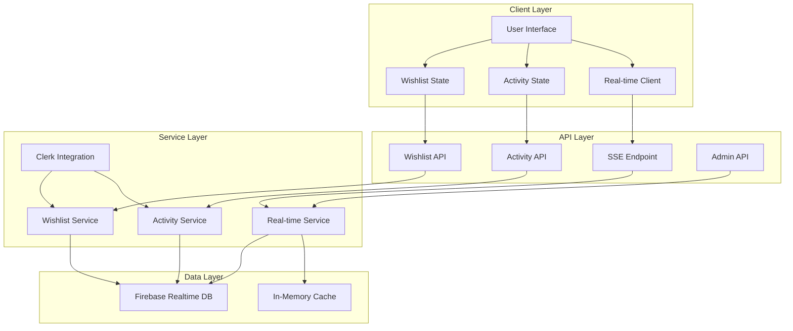

# Design Document

## Overview

The User Activity and Wishlist System will enhance the existing StealDeals platform by implementing comprehensive state management, real-time updates, and seamless integration with Clerk authentication. The system addresses the current issues with wishlist button functionality and provides administrators with real-time insights into user behavior.

**Key Design Decisions:**
- **Hybrid State Management**: Client-side optimistic updates with server-side persistence
- **Real-time Updates**: Server-Sent Events (SSE) for real-time dashboard updates
- **Database Strategy**: Firebase Realtime Database for real-time capabilities
- **Authentication Integration**: Seamless Clerk auth integration with fallback handling

## Architecture

### High-Level Architecture



### State Management Strategy

**Client-Side State Management:**
- React Context for wishlist state with optimistic updates
- Local state synchronization with server state
- Automatic retry mechanism for failed operations
- Offline-first approach with sync on reconnection

**Server-Side State Management:**
- Firebase Realtime Database for persistent storage
- In-memory caching for frequently accessed data
- Event-driven architecture for real-time updates
- Batch processing for non-critical operations

## Components and Interfaces

### 1. Client-Side Components

#### WishlistProvider Context
```typescript
interface WishlistContextType {
  wishlist: WishlistItem[];
  isLoading: boolean;
  error: string | null;
  addToWishlist: (propertyId: string) => Promise<void>;
  removeFromWishlist: (propertyId: string) => Promise<void>;
  isInWishlist: (propertyId: string) => boolean;
  refreshWishlist: () => Promise<void>;
}
```

#### ActivityProvider Context
```typescript
interface ActivityContextType {
  activities: Activity[];
  stats: ActivityStats;
  isLoading: boolean;
  logActivity: (type: ActivityType, propertyId?: string, metadata?: any) => Promise<void>;
  getActivityHistory: (limit?: number) => Promise<Activity[]>;
}
```

#### Real-time Hook
```typescript
interface UseRealTimeReturn {
  isConnected: boolean;
  lastUpdate: Date | null;
  subscribe: (channel: string, callback: (data: any) => void) => () => void;
}
```

### 2. Server-Side Services

#### Wishlist Service
```typescript
interface WishlistService {
  getUserWishlist(userId: string): Promise<WishlistItem[]>;
  addToWishlist(userId: string, propertyId: string, metadata?: any): Promise<WishlistItem>;
  removeFromWishlist(userId: string, propertyId: string): Promise<boolean>;
  getWishlistStats(userId: string): Promise<WishlistStats>;
  isInWishlist(userId: string, propertyId: string): Promise<boolean>;
}
```

#### Activity Service
```typescript
interface ActivityService {
  logActivity(userId: string, type: ActivityType, propertyId?: string, metadata?: any): Promise<Activity>;
  getUserActivity(userId: string, limit?: number): Promise<Activity[]>;
  getUserStats(userId: string): Promise<ActivityStats>;
  getGlobalStats(): Promise<GlobalStats>;
}
```

#### Real-time Service
```typescript
interface RealTimeService {
  broadcastWishlistUpdate(userId: string, action: 'add' | 'remove', propertyId: string): void;
  broadcastActivityUpdate(userId: string, activity: Activity): void;
  subscribeToUserUpdates(userId: string): EventEmitter;
  subscribeToGlobalUpdates(): EventEmitter;
}
```

## Data Models

### Wishlist Item
```typescript
interface WishlistItem {
  id: string;
  userId: string;
  propertyId: string;
  addedAt: Date;
  notes?: string;
  priority: 'low' | 'medium' | 'high';
  property: {
    title: string;
    location: string;
    price: number;
    imageUrl: string;
    type: string;
    bedrooms?: number;
    bathrooms?: number;
    area?: number;
  };
}
```

### Activity
```typescript
interface Activity {
  id: string;
  userId: string;
  type: ActivityType;
  propertyId?: string;
  timestamp: Date;
  metadata?: {
    searchQuery?: string;
    filters?: any;
    duration?: number;
    source?: string;
  };
  sessionId: string;
  ipAddress?: string;
  userAgent?: string;
}

type ActivityType = 
  | 'property_view'
  | 'wishlist_add'
  | 'wishlist_remove'
  | 'search'
  | 'filter_apply'
  | 'contact_inquiry'
  | 'property_share';
```

### Activity Stats
```typescript
interface ActivityStats {
  totalViews: number;
  wishlistItems: number;
  totalActivities: number;
  recentActivities: Activity[];
  topViewedProperties: Array<{
    propertyId: string;
    viewCount: number;
    property: PropertySummary;
  }>;
}
```

## Error Handling

### Client-Side Error Handling
- Optimistic updates with rollback on failure
- Toast notifications for user feedback
- Automatic retry with exponential backoff
- Graceful degradation for offline scenarios

### Server-Side Error Handling
- Comprehensive error logging with context
- Rate limiting for API endpoints
- Input validation with detailed error messages
- Database transaction rollback on failures

### Real-time Connection Handling
- Automatic reconnection with exponential backoff
- Connection state indicators in UI
- Fallback to polling when SSE fails
- Queue updates during disconnection

## Testing Strategy

### Unit Tests
- Wishlist service operations
- Activity logging and retrieval
- State management logic
- Error handling scenarios

### Integration Tests
- API endpoint functionality
- Database operations
- Real-time event propagation
- Authentication integration

### End-to-End Tests
- Complete wishlist workflows
- Activity tracking across user sessions
- Admin dashboard real-time updates
- Cross-browser compatibility

### Performance Tests
- Database query optimization
- Real-time connection scalability
- Memory usage monitoring
- API response times

## Implementation Phases

### Phase 1: Enhanced State Management
- Implement client-side context providers
- Fix wishlist button functionality
- Add optimistic updates
- Improve error handling

### Phase 2: Real-time Infrastructure
- Set up Server-Sent Events
- Implement real-time service
- Add connection management
- Create admin dashboard updates

### Phase 3: Advanced Features
- Add activity analytics
- Implement user behavior insights
- Create performance monitoring
- Add offline support

### Phase 4: Optimization
- Database query optimization
- Caching implementation
- Performance monitoring
- Scalability improvements

## Security Considerations

- Clerk authentication integration for all user operations
- Rate limiting on API endpoints
- Input sanitization and validation
- Secure real-time connections
- User data privacy compliance
- Admin authentication for sensitive operations

## Performance Considerations

- Efficient database indexing for quick lookups
- Caching frequently accessed data
- Batch processing for non-critical updates
- Connection pooling for database operations
- Lazy loading for large datasets
- Optimized real-time event filtering