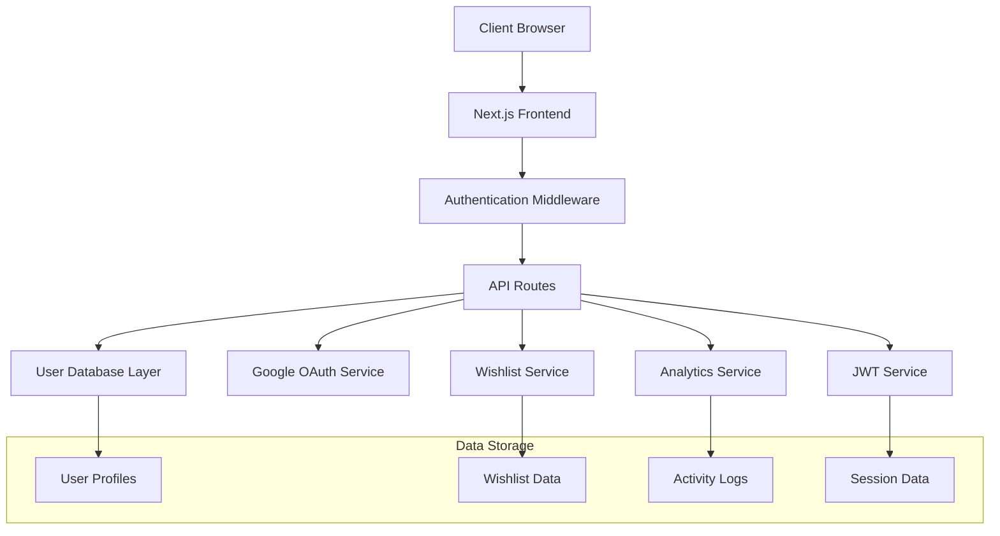
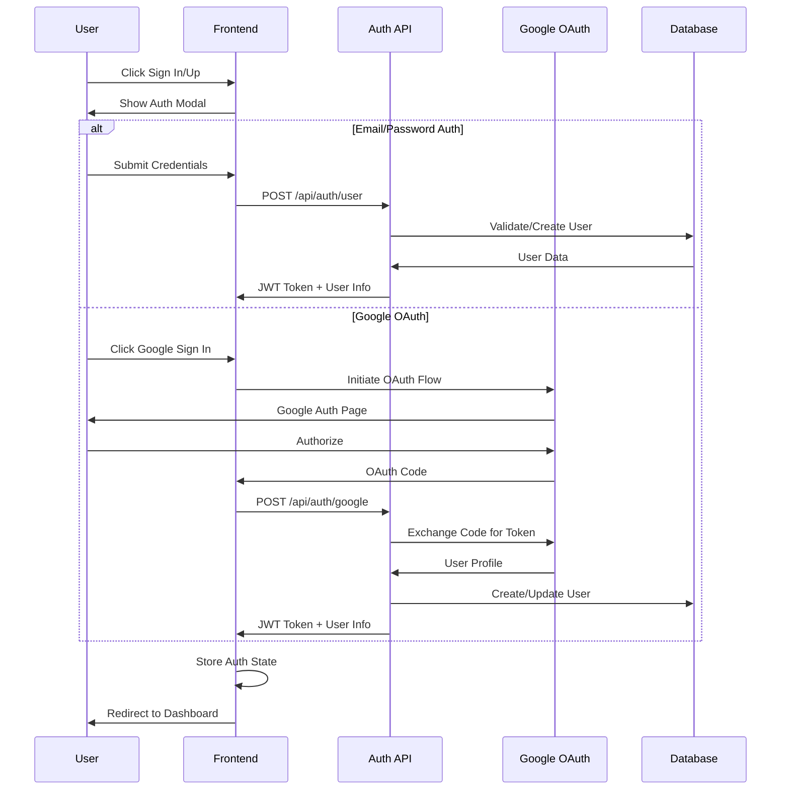

# Design Document

## Overview

The User Authentication System will extend the existing authentication infrastructure to support regular user registration, login, and personalized features. The system will integrate Google OAuth, implement a user dashboard with wishlist and analytics, and enhance the existing admin panel with user management capabilities.

The design leverages the existing Next.js 15 App Router architecture, JWT-based authentication, and adds Firebase for Google OAuth integration. The system will maintain the current admin authentication while adding comprehensive user management features.

## Architecture

### High-Level Architecture



### Authentication Flow



## Components and Interfaces

### Frontend Components

#### 1. Authentication Components
- **AuthButton**: Navigation bar authentication button with user icon
- **AuthModal**: Modal containing sign-in and sign-up forms
- **SignInForm**: Email/password login form with Google OAuth option
- **SignUpForm**: Registration form with email verification
- **GoogleAuthButton**: Google OAuth integration button
- **UserDropdown**: Authenticated user menu with profile and logout options

#### 2. Dashboard Components
- **UserDashboard**: Main dashboard layout with navigation
- **WishlistSection**: Display and manage saved properties
- **ActivityHistory**: Show user's property viewing history
- **UserAnalytics**: Charts and insights about user preferences
- **ProfileSettings**: User profile management interface

#### 3. Property Integration Components
- **WishlistButton**: Heart icon button for adding/removing properties from wishlist
- **PropertyCard**: Enhanced property cards with wishlist integration
- **AuthPrompt**: Modal prompting unauthenticated users to sign in

#### 4. Admin Components
- **UserManagement**: Admin interface for viewing all users
- **UserDetails**: Detailed view of individual user activity
- **UserAnalyticsDashboard**: Admin analytics for user engagement
- **ActivityMonitor**: Real-time user activity tracking

### API Interfaces

#### Authentication Endpoints

```typescript
// POST /api/auth/user/register
interface RegisterRequest {
  name: string;
  email: string;
  password: string;
}

interface RegisterResponse {
  success: boolean;
  token: string;
  user: UserProfile;
}

// POST /api/auth/user/login
interface LoginRequest {
  email: string;
  password: string;
}

interface LoginResponse {
  success: boolean;
  token: string;
  user: UserProfile;
}

// POST /api/auth/google
interface GoogleAuthRequest {
  code: string;
  state?: string;
}

interface GoogleAuthResponse {
  success: boolean;
  token: string;
  user: UserProfile;
  isNewUser: boolean;
}
```

#### User Management Endpoints

```typescript
// GET /api/user/profile
interface UserProfile {
  id: string;
  name: string;
  email: string;
  avatar?: string;
  createdAt: Date;
  lastLoginAt: Date;
  preferences: UserPreferences;
}

// GET /api/user/wishlist
interface WishlistResponse {
  properties: WishlistProperty[];
  total: number;
}

// POST /api/user/wishlist
interface WishlistRequest {
  propertyId: string;
  action: 'add' | 'remove';
}

// GET /api/user/activity
interface ActivityResponse {
  viewHistory: PropertyView[];
  searchHistory: SearchQuery[];
  engagementMetrics: EngagementData;
}
```

#### Admin Endpoints

```typescript
// GET /api/admin/users
interface AdminUsersResponse {
  users: UserSummary[];
  pagination: PaginationInfo;
  statistics: UserStatistics;
}

// GET /api/admin/users/[id]
interface AdminUserDetailsResponse {
  user: UserProfile;
  activity: UserActivity;
  wishlist: WishlistProperty[];
  analytics: UserAnalytics;
}
```

## Data Models

### User Model

```typescript
interface User {
  id: string;
  name: string;
  email: string;
  password?: string; // null for OAuth users
  avatar?: string;
  provider: 'email' | 'google';
  providerId?: string;
  role: 'user' | 'admin';
  isActive: boolean;
  emailVerified: boolean;
  createdAt: Date;
  updatedAt: Date;
  lastLoginAt: Date;
  preferences: UserPreferences;
}

interface UserPreferences {
  propertyTypes: string[];
  priceRange: {
    min: number;
    max: number;
  };
  locations: string[];
  notifications: {
    email: boolean;
    push: boolean;
    newProperties: boolean;
    priceAlerts: boolean;
  };
}
```

### Wishlist Model

```typescript
interface WishlistItem {
  id: string;
  userId: string;
  propertyId: string;
  addedAt: Date;
  notes?: string;
  priority: 'low' | 'medium' | 'high';
}

interface WishlistProperty {
  id: string;
  title: string;
  price: number;
  location: string;
  images: string[];
  type: string;
  addedAt: Date;
  notes?: string;
  priority: 'low' | 'medium' | 'high';
}
```

### Activity Model

```typescript
interface UserActivity {
  id: string;
  userId: string;
  type: 'property_view' | 'search' | 'wishlist_add' | 'wishlist_remove' | 'contact_inquiry';
  propertyId?: string;
  metadata: Record<string, any>;
  timestamp: Date;
  sessionId: string;
  ipAddress: string;
  userAgent: string;
}

interface PropertyView {
  propertyId: string;
  propertyTitle: string;
  viewedAt: Date;
  duration?: number;
  source: 'search' | 'wishlist' | 'direct' | 'recommendation';
}
```

### Analytics Model

```typescript
interface UserAnalytics {
  userId: string;
  totalViews: number;
  uniqueProperties: number;
  averageSessionDuration: number;
  favoritePropertyTypes: PropertyTypeStats[];
  preferredLocations: LocationStats[];
  activityByDay: DailyActivity[];
  conversionMetrics: ConversionData;
}

interface PropertyTypeStats {
  type: string;
  count: number;
  percentage: number;
}

interface LocationStats {
  location: string;
  count: number;
  percentage: number;
}
```

## Error Handling

### Authentication Errors

```typescript
enum AuthErrorCodes {
  INVALID_CREDENTIALS = 'INVALID_CREDENTIALS',
  EMAIL_ALREADY_EXISTS = 'EMAIL_ALREADY_EXISTS',
  WEAK_PASSWORD = 'WEAK_PASSWORD',
  GOOGLE_AUTH_FAILED = 'GOOGLE_AUTH_FAILED',
  TOKEN_EXPIRED = 'TOKEN_EXPIRED',
  UNAUTHORIZED = 'UNAUTHORIZED'
}

interface AuthError {
  code: AuthErrorCodes;
  message: string;
  field?: string;
}
```

### Error Handling Strategy

1. **Client-Side Validation**: Form validation using Zod schemas before API calls
2. **API Error Responses**: Consistent error format with specific error codes
3. **User-Friendly Messages**: Convert technical errors to user-friendly messages
4. **Retry Logic**: Automatic retry for transient failures (network issues)
5. **Fallback States**: Graceful degradation when services are unavailable

### Error Boundaries

```typescript
// Global error boundary for authentication failures
class AuthErrorBoundary extends React.Component {
  // Handle authentication-related errors
  // Redirect to login on token expiration
  // Show appropriate error messages
}

// Component-level error handling for wishlist operations
const WishlistErrorHandler = {
  handleWishlistError: (error: Error) => {
    // Log error for monitoring
    // Show user-friendly toast message
    // Provide retry options
  }
}
```

## Testing Strategy

### Unit Testing

1. **Authentication Logic**: Test JWT generation, validation, and Google OAuth integration
2. **API Endpoints**: Test all authentication and user management endpoints
3. **Data Models**: Validate data transformation and validation logic
4. **Utility Functions**: Test helper functions for password hashing, token management

### Integration Testing

1. **Authentication Flow**: End-to-end testing of sign-up, sign-in, and OAuth flows
2. **Wishlist Operations**: Test adding/removing properties from wishlist
3. **Admin Functionality**: Test admin user management and analytics features
4. **Session Management**: Test session persistence and expiration handling

### Component Testing

1. **Authentication Components**: Test form validation, error handling, and user interactions
2. **Dashboard Components**: Test data loading, display, and user interactions
3. **Wishlist Components**: Test property addition/removal and state management
4. **Admin Components**: Test user management interfaces and data visualization

### Security Testing

1. **Authentication Security**: Test for common vulnerabilities (SQL injection, XSS)
2. **Authorization**: Verify proper access control for protected routes
3. **Session Security**: Test session hijacking prevention and secure cookie handling
4. **Data Privacy**: Ensure user data is properly protected and encrypted

### Performance Testing

1. **Authentication Performance**: Test login/registration response times
2. **Dashboard Loading**: Test dashboard performance with large datasets
3. **Wishlist Operations**: Test performance with large wishlists
4. **Admin Analytics**: Test performance of admin dashboards with many users

## Security Considerations

### Authentication Security

1. **Password Security**: Use bcrypt for password hashing with appropriate salt rounds
2. **JWT Security**: Use secure JWT secrets, implement token rotation, set appropriate expiration
3. **OAuth Security**: Validate OAuth state parameters, use PKCE for additional security
4. **Session Security**: Use HTTP-only cookies, implement CSRF protection

### Data Protection

1. **Personal Data**: Encrypt sensitive user data at rest and in transit
2. **Activity Tracking**: Anonymize IP addresses and limit data retention
3. **Admin Access**: Implement role-based access control with audit logging
4. **API Security**: Rate limiting, input validation, and SQL injection prevention

### Privacy Compliance

1. **Data Minimization**: Collect only necessary user data
2. **Consent Management**: Implement clear consent mechanisms for data collection
3. **Data Portability**: Provide user data export functionality
4. **Right to Deletion**: Implement user account and data deletion features

## Performance Optimization

### Frontend Optimization

1. **Code Splitting**: Lazy load authentication and dashboard components
2. **Caching**: Implement proper caching for user data and wishlist
3. **Image Optimization**: Optimize property images in wishlist and dashboard
4. **Bundle Optimization**: Minimize JavaScript bundle size for authentication flows

### Backend Optimization

1. **Database Indexing**: Proper indexing for user queries and activity lookups
2. **Caching Strategy**: Redis caching for frequently accessed user data
3. **API Optimization**: Implement pagination and filtering for large datasets
4. **Background Processing**: Queue system for analytics processing and email notifications

### Monitoring and Analytics

1. **Performance Monitoring**: Track authentication success rates and response times
2. **User Analytics**: Monitor user engagement and feature adoption
3. **Error Tracking**: Comprehensive error logging and alerting
4. **Security Monitoring**: Track suspicious authentication attempts and security events