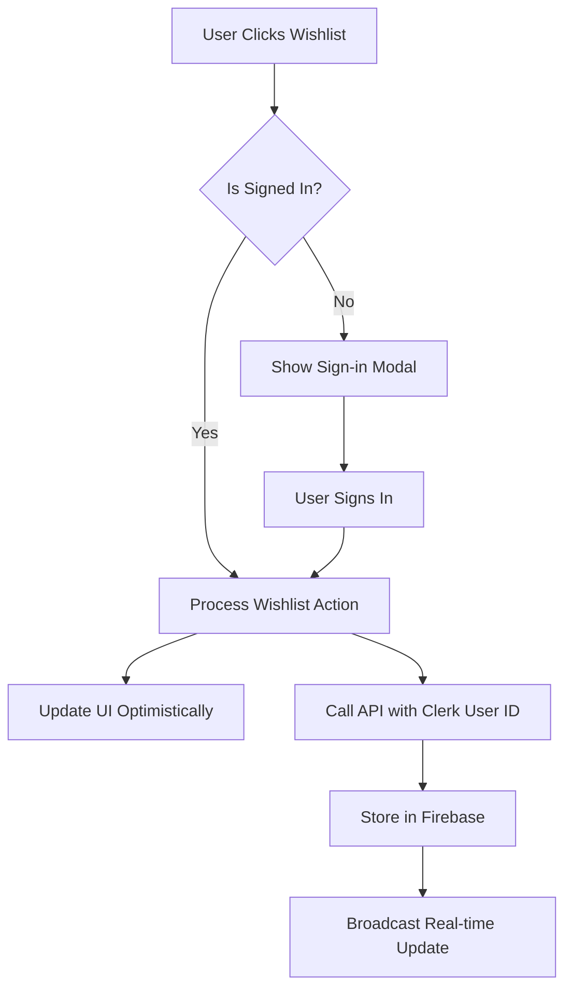

# Enhanced Wishlist & Authentication System

This document explains the comprehensive wishlist and authentication enhancements implemented for the StealDeals platform.

## 🚀 Features Implemented

### 1. Authentication-Gated Wishlist System
- **Smart Authentication Detection**: Wishlist buttons detect user authentication state
- **Sign-in Alerts**: Beautiful modal prompts for unauthenticated users
- **Seamless Integration**: Works with existing Clerk authentication
- **User-Specific Storage**: Each user's wishlist tied to their unique Clerk ID

### 2. Navigation Wishlist Button
- **Always Visible**: Wishlist button appears in navigation before sign-in
- **Interactive Prompts**: Shows authentication modals for guest users
- **Live Count Badge**: Displays wishlist item count for authenticated users
- **Responsive Design**: Works on both desktop and mobile

### 3. Admin Panel Integration
- **User Wishlist Viewing**: Admins can see each user's wishlist items
- **Real-time Updates**: Live connection status and activity tracking
- **Detailed Analytics**: User behavior patterns and engagement metrics
- **Comprehensive User Data**: Complete user profiles with wishlist insights

### 4. Real-time Activity Tracking
- **Live Updates**: Real-time connection with automatic reconnection
- **Activity Monitoring**: Track user actions and wishlist changes
- **Admin Dashboard**: Live user activity feeds in admin panel
- **Robust Error Handling**: Graceful failure and recovery mechanisms

## 🛠️ Setup Instructions

### Step 1: Set Admin Role in Clerk

Before accessing the admin panel, you need to set the admin role for your user account:

```bash
# Run this script to set admin role for a user
node scripts/set-admin-role.js your-email@example.com
```

**Or manually in Clerk Dashboard:**
1. Go to [Clerk Dashboard](https://dashboard.clerk.com)
2. Navigate to Users
3. Select your user account
4. Go to "Metadata" tab
5. Add to Public Metadata:
   ```json
   {
     "role": "admin"
   }
   ```

### Step 2: Environment Configuration

Ensure your `.env.local` has the required Clerk variables:

```env
# Clerk Authentication
NEXT_PUBLIC_CLERK_PUBLISHABLE_KEY=pk_test_your_key_here
CLERK_SECRET_KEY=sk_test_your_secret_here

# Firebase Configuration (for wishlist storage)
NEXT_PUBLIC_FIREBASE_API_KEY=your_api_key
NEXT_PUBLIC_FIREBASE_DATABASE_URL=https://your_project.firebasedatabase.app
NEXT_PUBLIC_FIREBASE_PROJECT_ID=your_project_id
# ... other Firebase config

# Application Configuration
NEXT_PUBLIC_APP_URL=http://localhost:3000
NODE_ENV=development
```

### Step 3: Test the Implementation

Run the comprehensive test suite:

```bash
# Run all tests
npm run test

# Run specific wishlist tests
npm run test -- --grep "Enhanced Wishlist"

# Run tests in watch mode
npm run test:watch
```

## 📖 Usage Guide

### For Regular Users

#### 1. Viewing Wishlist
- **Navigation Button**: Click the heart icon in the navigation bar
- **Authentication Required**: Sign in when prompted to access your wishlist
- **Persistent Storage**: Your wishlist is saved across sessions

#### 2. Adding to Wishlist
- **Property Pages**: Click the heart button on any property
- **Sign-in Prompt**: If not authenticated, you'll see a sign-in modal
- **Instant Feedback**: Optimistic updates with loading states

#### 3. Managing Wishlist Items
- **Toggle Items**: Click heart button to add/remove from wishlist
- **Visual Feedback**: Filled heart = saved, outline heart = not saved
- **Count Display**: See total count in navigation badge

### For Administrators

#### 1. Accessing Admin Panel
- **URL**: Navigate to `/admin/dashboard`
- **Authentication**: Must have `role: "admin"` in Clerk metadata
- **Auto-redirect**: Unauthorized users redirected to login

#### 2. Viewing User Wishlists
1. Go to **Admin Dashboard** → **Users**
2. Click **View Details** on any user
3. Switch to **Wishlist** tab
4. See all user's saved properties with details

#### 3. Real-time Monitoring
1. Navigate to **Analytics** tab in user details
2. Monitor live connection status
3. View real-time engagement metrics
4. Track user behavior patterns

## 🔧 Technical Implementation

### Authentication Flow


### Data Storage Architecture
- **Authenticated Users**: Firebase Realtime Database keyed by Clerk User ID
- **Guest Users**: Local Storage with session persistence
- **Admin Access**: Secure API routes with role-based authentication
- **Real-time Updates**: Server-Sent Events for live synchronization

### API Endpoints

#### User Endpoints
- `GET /api/user/wishlist` - Get user's wishlist
- `POST /api/user/wishlist` - Add/remove wishlist items
- `GET /api/user/wishlist/check` - Check if property in wishlist

#### Admin Endpoints
- `GET /api/admin/users` - List all users (admin only)
- `GET /api/admin/user-details` - Get detailed user info (admin only)
- `GET /api/admin/user-realtime-stats` - Real-time user stats (admin only)

## 🚦 Testing Strategy

### Automated Tests
- **Unit Tests**: Individual component functionality
- **Integration Tests**: Complete user workflows
- **API Tests**: Backend endpoint validation
- **Real-time Tests**: WebSocket and SSE connections

### Manual Testing Checklist

#### Authentication Gating
- [ ] Unauthenticated users see sign-in prompts
- [ ] Authenticated users can use wishlist normally
- [ ] Sign-in modal appears and functions correctly
- [ ] Navigation button shows appropriate state

#### Admin Panel
- [ ] Admin role required for access
- [ ] User wishlists display correctly
- [ ] Real-time connections work
- [ ] Activity tracking functions

#### Error Handling
- [ ] Network errors handled gracefully
- [ ] Invalid permissions show proper messages
- [ ] Loading states work correctly
- [ ] Optimistic updates revert on failure

## 🔍 Troubleshooting

### Common Issues

#### 1. "Forbidden - Admin access required"
**Solution**: Set admin role in Clerk metadata
```bash
node scripts/set-admin-role.js your-email@example.com
```

#### 2. Wishlist not persisting
**Solution**: Check Firebase configuration and database rules
```javascript
// Firebase rules should allow authenticated users
{
  "rules": {
    "wishlist": {
      "$userId": {
        ".read": "$userId === auth.uid",
        ".write": "$userId === auth.uid"
      }
    }
  }
}
```

#### 3. Real-time disconnection
**Solution**: Check SSE endpoint and browser network tab
- Verify `/api/realtime` endpoint is accessible
- Check for CORS issues
- Monitor browser console for connection errors

#### 4. Navigation button not working
**Solution**: Ensure WishlistProvider wraps the app
```tsx
function App() {
  return (
    <ClerkProvider publishableKey={process.env.NEXT_PUBLIC_CLERK_PUBLISHABLE_KEY}>
      <WishlistProvider>
        <Header />
        {/* Rest of app */}
      </WishlistProvider>
    </ClerkProvider>
  );
}
```

## 📊 Performance Considerations

### Optimization Features
- **Optimistic Updates**: Immediate UI feedback
- **Debounced API Calls**: Prevent rapid-fire requests
- **Real-time Batching**: Efficient WebSocket usage
- **Lazy Loading**: Components load when needed

### Monitoring
- **Performance Metrics**: API response times tracked
- **Error Rates**: Failed requests monitored
- **User Analytics**: Engagement patterns analyzed
- **Connection Health**: Real-time status tracked

## 🔮 Future Enhancements

### Planned Features
- **Wishlist Sharing**: Share wishlists with other users
- **Property Notifications**: Alerts for wishlist property updates
- **Advanced Filtering**: Sort and filter wishlist items
- **Export Functionality**: Download wishlist as PDF/Excel

### Technical Improvements
- **Offline Support**: PWA capabilities for offline access
- **Push Notifications**: Browser notifications for updates
- **Enhanced Analytics**: More detailed user behavior tracking
- **Performance Optimization**: Further speed improvements

## 📞 Support

For technical support or questions:
- **Development Issues**: Check console logs and error messages
- **Configuration Help**: Review environment variables and API keys
- **Feature Requests**: Submit via project issue tracker
- **Bug Reports**: Include steps to reproduce and error logs

---

**Version**: 1.0.0  
**Last Updated**: January 2024  
**Compatible With**: Next.js 15+, Clerk Auth, Firebase Realtime Database